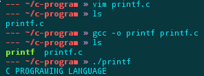

# Linux吧 炸道指南

>欢迎来到百度Linux吧。本指南专为贴吧新人而写，因为本吧的特殊情況，所以务必看【完】再发贴

## 快速通道

>  为初入贴吧的新人准备，收集常见问题以及各种传送门

### 买电脑系列

【买了个电脑是 Linux 系统，怎么开不了机啊？】

左转：[Windows10吧](http://tieba.baidu.com/f?kw=Windows10)，[Windows8吧](http://tieba.baidu.com/f?kw=Windows8)，[Windows7吧](http://tieba.baidu.com/f?kw=windows7)

### 引导急救问题

> 以下几个不一样注意区分！

1. 在 Windows 下直接删除 Linux 分区导致 「grub rescue」无法进入 Windows 解决：

   * [在Windows8下删掉Linux后，无法进入系统](https://answers.microsoft.com/zh-hans/windows/forum/windows_8-system/%E5%9C%A8windows8%E4%B8%8B%E5%88%A0%E6%8E%89linux/299b7cd7-e418-4272-978e-e9e88fb9a0a7)
   * [MBR的修复与Ubuntu的卸载](http://blog.csdn.net/u010940849/article/details/11763135)
   * [如何用diskgenius 这个工具修复MBR](https://zhidao.baidu.com/question/402841617.html)

2. 重装 Windows 导致 Linux 无法进入：

   Grub2: 一般情况：[重装Windows后如何进入Ubuntu](http://www.mintos.org/skill/ubuntu-restore-grub2.html)

   Grub Legacy（CentOS6及以下等旧版本）：[双系统重装windows后无法进入linux 系统解决方案](http://blog.sina.com.cn/s/blog_6c25b1e50101h7cq.html)

3. 因为 Grub 未正确配置导致 「grub rescue」无法进入 Linux 系统：

   [Ubuntu 开机出现 grub rescue> 终端模式修复方法](http://www.linuxidc.com/Linux/2012-07/65249.htm)

4. 用 Windows 引导 Linux 【多方案】，可以用来解决问题二：

   [windows下添加ubuntu引导教程](http://forum.ubuntu.org.cn/viewtopic.php?f=139&t=376981)

### 日常

- 怎么编译 C 程序：

  

- Linux 怎么读：

    /ˈlɪnəks/ 

- 哪个发行版本用的人多：详情可查看 [DistroWatch](http://distrowatch.com/)

- 更多问题：[请查看贴吧 FAQ](http://tieba.baidu.com/p/2416364596)

## 先别着急！

>首先要确定一下，你是不是适合使用 Linux。如果不适合，最好还是回到 Windows/Mac 的怀抱。

### 几种一时兴起的情况

如果你只是一时兴起，先冷静一下，看看是不是以下几种情况之一：

1. 我是单纯因为 XP 停止支持来寻找一个在老式机器上运行良好的替代系统
2. 我是单纯因为国家推广国产操作系统而对 Linux 产生兴趣想试一试
3. 我仅仅是想搞 OI(信息学奥林匹克) 的初中/高中学生，或是搞 ACM 的大学生，要拿这系统学写程序
4. 我仅仅是听别人说 Linux 如何牛，怎么怎么好用，就想试试看

如果是第一种或第二种情况请直接移步 [Linux贴吧入吧须知](http://tieba.baidu.com/p/3065646448) 这个帖子；如果是第三种的话，注意并不是在所有赛事中 Linux 都是必须的，请先确认一下再来；若是第四中情况，可以先在**虚拟机**里玩玩试试（不要用真机！），看看怎么样，以免伤筋动骨影响正常用电脑。

### 几种不同类型的计算机用户

如果对于你来说用 Linux 并不是刚性需求，那么请先在下面列出的几类用户中对号入坐一下，看看自己到底适不适合用 Linux:

一、真正的普通用户，以能用，能用电脑达到自己的目的为目标，根本不会管用的是什么系统。

> 我也见过不少喜欢用 PPS 看肥皂剧，即便哪天换成了风行也无所谓的大妈。
>
> 甚至也见过大字不识，一进网吧就让老板开 CS 的玩家。
>
> 啥叫普通用户？真正在“用”电脑的人，有关心过自己面对的是什么系统什么软件吗？
>
> 换个鲜活的例子来说，就是几年前手机刚兴起的时候，全国成千上万的人都在用，但有几个人知道自己的手机也有操作系统的？
>
> 有几个人能说出两部不同牌子的手机的软件有啥不一样的？
>
> —— 老w

二、关心自己电脑，关注自己的软件，但只关心软件的效率，功能，用着顺手不顺手，更深层的东西一概不管（不少人都是这个情况）

三、跟第二种相比，喜欢定制配置软件，对电脑的使用比较讲究，甚至有一定的洁癖（很少）

四、开发/运维/Geek 等（也很少）

第三种和第四种用户，是非常适合用 Linux 的。

然而如果你是第一种用户或是第二种用户，那还是直接回到你原来的系统吧，使用 Linux 只会造成更多的麻烦。除非只是好奇，想试一下。

这是因为使用 Linux 免不了折腾，如果没有更高的需求，就又享受不到折腾带来的好处，到头来就成了瞎折腾。

### 好的标准

到底什么是「好」？适合自己的才是最好的。Linux 确实很好，但如果不适合自己的话用起来也很难受。

在乐高（Lego）玩具发生的类似的情况正好阐述这种问题。试想下面的情景：

新用户（以下简称“新”）：我想要一部新玩具汽车，每个人都因乐高汽车的好玩而着了迷。所以我也买了它，但当我到家后我才发现，我的盒子里只有积木和齿轮！我的车子在哪里？

老用户（以下简称“老”）：你应该用积木组装一辆车，这才是乐高的真谛。

新：什么？？我不知道应怎样拼装这台车子。我不是个机械师。我该怎么知道如何组装它？

老：盒子里有使用手册。它上面写着拼装车子的步骤。你不用知道原理，只要按照按部就班就好。

新：好吧，我找到了说明。这得花多久啊！为什么他们不能装好了再卖给我，还得让我自己动手？？

老：并不是所有人都满足于将乐高做成玩具车。这些积木可以被我们组成万物。这才是游戏的真谛。

新：我仍旧不明白为什么厂商不能给我们这种想要车子的人一个成品，如果那些喜欢动手的人高兴可以自己拆了它阿。不管怎样，我还是将它组装起来了，尽管某些部件时不时地掉下来。我有什么方法可以解决吗？我能将它们粘起来吗？

老：这就是乐高。他就是用来拆装的。这才是游戏的真谛。

新：但我不希望总是拆拆装装，我仅仅希望一辆玩具车而已！

老：呃，你到底是为什么要买乐高？

注： 上面这段乐高的比喻来自 [Linux 不是 Windows](https://tieba.baidu.com/p/1677342775) 这篇写得很不错的文章，有空可以看看全文。

## 用什么发行版好

> 如果你适合（或者必须）用 Linux 的话，那么可以继续往下看。入门 Linux 的第一个令人头疼的问题，不是技术问题，而是如何选择发行版。下面就稍微讲解一下发行版应该怎么选。

### 发行版简介

#### 分级

不同的发行版由于面向的需求不同，使用的难度也有所不同。后面的列表中，我们将按照难度把它们分级。分级的标准如下：

[I] —— 入门级，带有桌面和方便的工具

[I+] —— 比入门级稍难一点

[II] —— 进阶级，没有自带桌面，定制空间大

[II+] —— 定制空间更大，但难度也更高

[III] —— 地狱模式

虽然新手直接用较高难度的发行版，从理论上讲没什么问题，但还是不推荐这样做。

#### 必要的概念解释

【滚动升级】简称【滚】，又称【滚动更新】【滚动发行】，本吧最常用的术语之一，是指没有固定的系统版本，每天都有更新，所有软件更新后会升级到尽量新的版本，不需要重新安装新版本的操作系统或进行指定的系统版本升级的这样一种更新方式，**但有一定风险**。

与之相对的，大部分发行版采用冻结机制。比如说，在系统最新版本为 6 时，软件 A(1.0) 出了新版本 2.0，那么可以更新到 2.0 版本；当系统出了版本 7 后，系统版本 6 被冻结，提供的软件将不再更新，那么即使 A 又出了新版本 3.0，使用系统 6 的用户就无法更新到 3.0，想用 3.0 就必须更新整个系统到 7。当然，这不是绝对的。有时开发者会把新的软件向已冻结的旧版本系统移植，重要的安全更新也是持续推送。 

#### 部分常见发行版列表

【注】以下发行版均有中文支持

【警告】在 Linux 下，不要把默认样式看作一成不变（样式是有很大的调整空间的）

- [I] Deepin: 深度 Linux, 国内发行版，自称是面向普通用户的，但目前还没能达成目标。不过已经弄得很容易上手了。
  https://deepin.org

- [I+] Debian：历史久远的发行版，以稳定著称，通用多架构操作系统，有三个分支：稳定分支 (stable)、测试分支 (testing)、不稳定分支 (unstable, 滚动升级)。
  https://debian.org

- [I] Ubuntu： 基于 Debian,（可能是）最流行的桌面发行版，以易用著称。21 世纪 00 年代中后期受到的好评较多。但 2011 年引入的新的 Unity 桌面环境有些不稳定，经常被黑。不过也可以选择预装其它桌面环境的衍生版（如 Kubuntu/Xubuntu/Lubuntu）
  http://ubuntu.com

- [I] Mint：基于 Ubuntu 的发行版，同时有基于 Debian 的版本。特色为简洁。桌面环境偏向传统。
  http://linuxmint.com

- [I+] Centos：服务器比较适用的发行版，比较稳定，RHEL 的社区版。
  http://centos.org

- [I] Fedora: 桌面发行版，相当于 RHEL 的不稳定分支，但不是滚动升级的。更新较快，软件较新，曾被称为「小白鼠」。
  http://fedoraproject.org

- [I] OpenSUSE：曾经被评价为最华丽的Linux桌面发行版。目标是成为所有人都能够得到的最易于使用的 Linux 发行版。
  http://opensuse.org

- [II] ArchLinux：滚动升级，高度定制，软件丰富，配置集中的发行版。
  http://archlinux.org

- [II+] Gentoo：安装软件大多数是编译安装，可以调整编译参数，有极高的定制空间。被看作最稳定的滚动升级发行版。
  http://gentoo.org

- [II+] Slackware：力图成为「UNIX风格」的Linux发行版本。它的软件包管理系统不会自动解决依赖关系。历史悠久。详细介绍见 [一个真实的Slackware](http://tieba.baidu.com/p/3351882243) 这个帖子。
  http://slackware.com

- [III] LFS: 从零开始构建系统。
  http://linuxfromscratch.org

注：Fedora 有时被称作「地沟油」，这只是出自本吧的梗，井不是说这个发行版不行。

### 下载地址

如果官网下载比较慢，可以选择使用国内镜像：

[中科大的镜像站](https://mirrors.ustc.edu.cn/)

[清华大学的TUNA镜像站](https://mirrors.tuna.tsinghua.edu.cn/)

[阿里源](https://mirrors.aliyun.com/)

[网易开源镜像站](http://mirrors.163.com/)

（可能找到相应的文件比较费功夫，但只要有耐心的话基本上都能找到的）

## 提问的智慧

来本吧提问的时候，特别注意两点：

1. 问题具体

2. 信息充足

烂问题：

- 找不到文件怎么办？

好问题：

- 找不到文件「.abc」，在家目录里找没找到，ls 一下也没有，但是直接敲路径有啊，怎么回事？【图】

详：http://wiki.woodpecker.org.cn/moin/AskForHelp

## 月经帖和一些不合适的发言

（本节原作者 reverland, 有删改）

lz: Linux 各大版本应该统一起来，干掉大硬 balabalabala……

网友：书生意气，挥斥方遒，指点江山，……

lz: 国家推广…… Linux普及…… 指日可待……

网友：先让另一只企鹅支持这只企鹅再说。

lz: 我想学 linux，想成为一个电脑高手，但我讨厌编程和英语。怎么破？

网友：做个好梦。

lz: 安装个软件，下载下来是 exe 的，用软碟通做成 .iso 的了。然后虚拟机里面 cd 中也改了，进入系统打开光盘，为毛还是 exe 文件？真不懂了！ 

网友：楼主其实想要把雪碧变成加多宝凉茶。于是楼主买了一听雪碧，用油漆把瓶子刷成红色，并写上加多宝三个字。但是，楼主打开罐子，却很惊讶为什么尝起来仍然是雪碧的味道。 

lz: 各位大大，我想成为黑客，求大神带。

网友：多晒太阳就行了。

lz: 各位大神，冰天雪地跪求解决，%￥&￥%……#￥

lz: 没有人吗？

lz: 我很生气，你们懂不懂什么叫分享叫互助，这里真渣

网友：抱歉，不知道你在问什么……

lz: 老听人说 linux 很好。我今天一试，我靠，各种用户不友好，还不能用 qq，真渣，你们竟然用这么烂的东西，都是 sb 吗？

网友：lz 你妈喊你回家吃饭

lz: 我很气愤，linux 真是太烂了。想我有两年 windows 开发经验的人竟然不会弄，真是太烂了。

网友：我不觉得你骑了两年自行车对你开车有什么帮助……

lz: linux 下竟然不能用 office！！linux 下软件太少了！！竟然不能玩这么多大型游戏。Oh，Shit！！真是垃圾。

网友：不明白你为什么要用打印用的 A4 纸擦屁股,然后抱怨打印纸擦起来一点也不爽。

lz: 求问各位大大，哪个 linux 发行版最好

网友：鸡和鸭哪个更好吃？

lz: linux 没有钱途，奉劝各位用 linux 的赶紧退散。

网友：你想多了吧……

lz: windows 用的挺好的嘛，为什么你们这群人要和别人不一样呢？又不能靠它赚钱，浪费时间和生命。

网友：老子招你惹你了，秀理智先去找那些打游戏的和看电视剧的。

lz: 为什么要用 linux，linux 可以赚大钱？

网友：装 X，滚！ (Install X, rolling upgrade)

lz: linux 么，不就是像 dos 一样的破玩意，早过时了。

网友：***不会用维基百科吗？

lz: 十年前我用过 linux，非常难用。

网友：十年前的东西现在看貌似都不好用……

lz: wo de shu ru fa tiao bu chu lai za ban?

网友：pin- yin- bu/ shi\ ke^ yi^ jiao- liu/ de yu^ yan/

lz: Ubuntu13.04 怎么比 XP 都慢啊？

网友：XP 这十年前的系统你跟 2013 年 4 月的 Ubuntu 比？？？

lz: 这是我发明的永动机

网友：为什么放弃治疗？？？

lz: 你们觉得国内 Linux 发行版哪个最合国人习惯

网友：深入贯彻落实带三个表重要思想。

lz: 实际上，大部分操作系统都不是真正的安装，它们省略了编译、调试和配置这三个步骤，充其量是复制系统。而 gentoo 等少数系统，才是真正的安装系统。

网友：实际上，大部分人喝茶都不是真正的喝茶，他们省略了播种、施肥和采摘茶叶这三个步骤，充其量是把茶灌进肚子里，……

lz: ruby 是日本人发明的，爱国的都来抵制它

网友Ａ: 天朝的东西都是垃圾，

网友Ｂ: lz 你这个5毛，**你吗，草拟×%&

网友Ｃ: 2l 个美分,**你%……&×

lz: 发个新闻:据说大概也许可能似乎 nvidia…………

网友甲：我早知道 nvidia 是个垃圾公司，我从来就不用 n 卡，nvidia 我草拟……×%%%

网友乙：一直不用 n 卡

网友丙：垃圾 nvidia，我早看它不顺眼了，都是垃圾产品

网友丁：……弱弱说声，我觉得 nvidia 的卡在我这里表现挺好的啊，比 A 卡好……

网友戊：楼上 2B 不解释

网友己：lss 是水军，是 nvidia 的托

网友庚：**你吗比 lsss，老子的 n 卡烂的 EB

lz: 抱歉，打错了，是 ati……

## Linux 哲学与历史

关于 Linux 的哲学与历史，可以看看《Revolution OS》这部纪录片。

## 关于伸手党

伸手党是指**可以**做一件事，却伸手叫别人帮他做。

当你使用 Linux 时出现问题时，一般用**搜索引擎**都能找到答案，一些常用的搜索引擎如下

1. [Google](https://www.google.com)
2. [百度](https://www.baidu.com/)
3. [Bing](http://cn.bing.com/)
4. [DuckDuckGo](https://duckduckgo.com/)

WHAT IS "伸手党"?

比如“电源开关在哪里？”

深度一点的“BIOS引导该肿么改？”

再深度一点的“LINUX 有汉化版么？”

我只想说：

## 杂项

### 推荐书籍

【入门】《[笨兔兔的故事](http://forum.ubuntu.org.cn/viewtopic.php?t=267518)》(实体书名：linux入门很简单)

【入门】《鸟哥的 linux 私房菜》(服务器向)

[正体] http://linux.vbird.org

[简体] http://vbird.dic.ksu.edu.tw

### 关于 QQ

QQ 是个不错的即时通讯软件，但是由于其 Linux 版不够给力以及不再更新，所以不少 Linux 用户不用 QQ.

如果非要用的话，可以考虑 Wine QQ, 详情见 [Wine QQ 杂交版诞生，目测当前最稳定版本](http://tieba.baidu.com/p/4814636033) 这个帖子。

吧里有 IRC 聊天频道, freenode #linuxba, 详见：

http://tieba.baidu.com/p/2416273603

同时这个频道也是联通 Telegram 的。

### 关于游戏：

linux 上游戏有不少，只是没有所谓的「主流游戏」（Tencent 系列）

有的 Windows 游戏可以虚拟机，有的可以用 Wine 启动，而且 Steam 里的游戏多到玩不完，原生游戏也有不少。

### 推荐网站：

https://linux.cn/

http://chinaunix.net

http://www.linuxfans.org

http://www.linuxsir.org

## 实战使用中容易碰到的种种问题

### 兼容

经常有很多人发出类似的抱怨「Linux 为什么不能运行 exe」

其实这是理所应当的。就好比上面雪碧和加多宝的例子。

但是有一个叫做 Wine 的程序可以运行一部分 Windows 程序：

http://zh.wikipedia.org/wiki/Wine

### 被英语绊倒

基础还可以的话，查单词慢慢就能看懂；基础不行的话，建议补一补。

### 按书上操作无果

一般情况是书太老了。换一本新书。

### 学的没有方向

先从折腾桌面美化或配置各种服务器开始。
